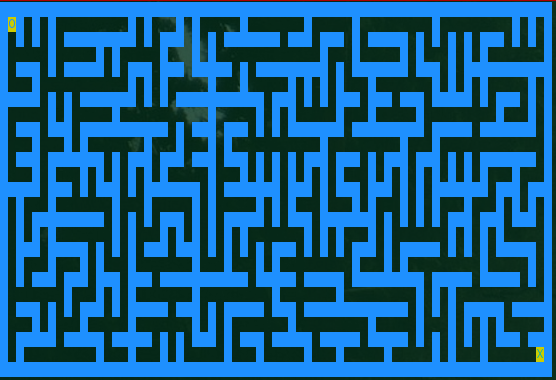
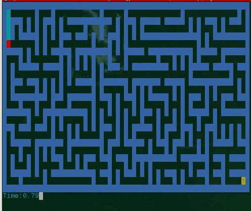
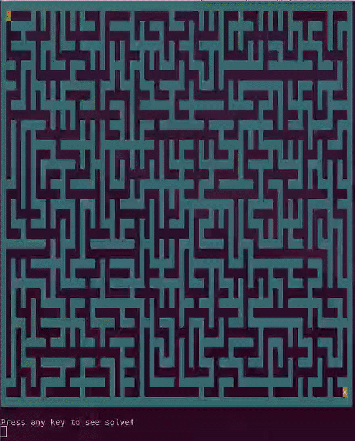

# PyMaze
## About
This program provides a quick and easy solution to your maze-deficiency issues. There are generally two use cases for this program, to generate a file containing a maze to solve or to start an interactive maze game within your favorite terminal. Have fun!
_TERMINAL MUST USE A MONOSPACED FONT TO WORK PROPERLY_

# Usage
See the Details section for more details information about maze files and option details.
To create a randomly generated maze execute

	python3 pymaze.py

Or the script can invoked be the default environment python3 interpreter.

	./pymaze.py

	./pymaze.py -[OPTION=ARG]*
	Options:
		-width COL	Sets the maze width (number of columns) to COL (Must be greater than 0). Default is 20
		-height ROW	Sets the maze height (number of rows) to ROW (Must be greater than 0). Default is 12
		-seed SEED	Sets Random Number Generator's seed to SEED.  Default seed is random
		-out NAME	Sets output file prefix to NAME, default is seed number		
		-interactive	Starts CLI maze game. Does not save to file	
		-block	Print maze using Unicode block characters, only works with interactive mode	
		-color	Print maze using ANSI style coloring, only works with interactive mode	
		-solve	Displays the solution to the maze in real-time, only works with interactive mode
		-help	Prints this menu

## Examples

### Output

If your terminal is Unicode and ANSI compatible, the following command will genarate a Unicode and colored representation of the maze. 

	python3 pymaze.py -width 34 -height 12 -block -color

### Interactive Mode
The following command will start an interactive 15 by 15 maze game in the terminal as demonstrated below. The -block option only works with ANSI and Unicode compatible terminals, so remove from the command if garbage text appears.
Also, if the maze is larger than the terminal please quit and either resize the terminal window or the maze settings.	

	python3 pymaze.py -interactive -block -color -width 20 -height 15

#### Solution
A solution to the maze can be solved in interactive mode in real-time with the -solve option. This option only works in interactive mode as of now since it tries multiple moves and selects a path using a backtracking algorithm. The following command is demonstrated below and will run without the -color and -block options if neither is supported.

   	python3 pymaze.py -interactive -solve -width 35 -height 20 -block -color

### Unaligned Output
This program relies on the users font to be monospaced, this holds true whether the maze is being viewed in the terminal or in a text editor. 

### Garbled Output

Try removing the -color option and retry the command. If this is succesful then the terminal you are using is not ANSI compatible but supports Unicode.
If it still outputs a mess or you want to get the ANSI coloring working, then see below.

#### Linux and MacOSX
Most Linux and MacOS terminals are both Unicode and ANSI compatible and the above command should print fine, however if the output does not look proper, try using a different terminal. 

#### Windows
If you are running Windows and the output does not look proper try switching to Windows Powershell. 

# Details
## Maze Generation
As of now, the algorithm employs a randomized [Kruskal's Algorithm](https://en.wikipedia.org/wiki/Kruskal%27s_algorithm) to generate Mazes. This algorithm creates a dense undirected graph where each 2D cell is connected to its neighboring cells. If the player is able to move move from cell A to cell B then there exists an edge between the two cells. These edges are referred to as portals. Kruskal's Algorithm is used to generate a Minimum Spanning Tree (MST) such that every cell is accessible to every other cell. To allow for a single solution, an MST contains no cycles, meaning that there is a unique path from one cell to any other cell. 

## Maze Files
Each maze consists of two files named suffixed with _maze.txt and _portals.txt. 
The _maze.txt files is an ascii representation of the maze. 
The marks S and X within the corner cells correspond to the Start and End of the maze respectively. 
The width of the maze refers to number of columns in the maze.
The height of the maze refers to number of rows in the maze. 

## Portals
These files are used for debugging purposes and represent the edges of the maze's undirected graph structure. 
The _portals.txt is a list of 2D coordinates. Each coordinate is a pair of cell identifiers and if a pair exists, an edge between the cells exists. These edges are referred to as portals since the player may move between the two cells.

Example on a 3x3 Maze
	
	+-+-+-+
	|0 1|2|
	+ + + +
	|3|4|5|
	+ + + +
	|6|7 8|
	+-+-+-+	
Portals text file will contain: 

	(0, 1) (0, 3) (1, 4) (2, 5) (3, 6) (4, 7) (5, 8) (7, 8)

NOTICE: Graph is undirected so Portals do not repeat, since (a, b) is equivalent to (b, a) so, only one will not be listed. This is to limit the number of listings printed.

## Cells
Each maze is a 2D grid of cells each implicitly labeled with a unique sequential identifier. 
Cells are located at column by row coordinates. A cells coordinates are at (x, y) then its unique identifier will be equal to y*width+x. This allows to reference the cells and portals like the above 3x3 example.

## Seed Numbers
The number that is prepended to these files is the randomly generated number that seeds python's random number generator. The seed value determines the sequence of values generated, and using the same seed ontwo mazes of equal dimensions will generate the same maze. By default the seed is random if not explicitly set. So running the script without the seed option will generate a new maze each execution.

